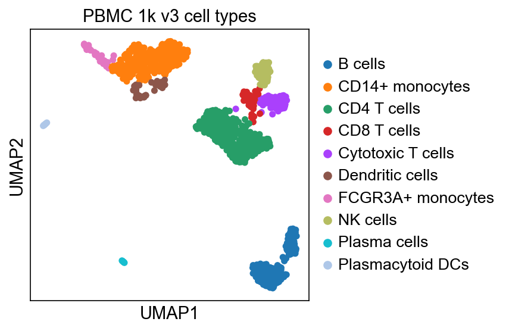

# Single-cell RNA-seq PBMC analysis with Scanpy

This is a hands-on single-cell RNA-seq analysis project built with the
**scverse / Scanpy** ecosystem. It demonstrates a standard PBMC workflow end to end:
quality control, filtering, normalisation, dimensionality reduction, Leiden
clustering, marker-gene ranking and cell-type annotation.

The project follows the grammar of the official
[scverse Scanpy basic tutorial](https://github.com/scverse/scanpy-tutorials/blob/main/basic-scrna-tutorial.ipynb),
then applies the same workflow independently to a different 10x PBMC dataset.

## Notebooks

- `01_scrna_pbmc3k.ipynb` - learning walkthrough on the classic 3k PBMC dataset.
- `02_scrna_pbmc1k_v3_analysis.ipynb` - completed independent analysis on 10x PBMC
  1k v3 data, including my QC choices, clustering decision and annotations.

## Data

- Notebook 1: 3k PBMCs from `scanpy.datasets.pbmc3k()`.
- Notebook 2: 10x Genomics `pbmc_1k_v3`; the notebook downloads the public `.h5`
  file into `data/` on first run.

Large generated files are not committed. The notebooks are reproducible from the
environment files and public data sources.

## Workflow

1. Load raw UMI count matrix.
2. Calculate QC metrics: genes per cell, counts per cell and mitochondrial percent.
3. Filter low-quality cells, likely doublets and rarely detected genes.
4. Normalize counts and log-transform expression values.
5. Select highly variable genes.
6. Scale, run PCA and build the nearest-neighbor graph.
7. Compute UMAP and Leiden clusters.
8. Rank marker genes per cluster.
9. Annotate cell types from known PBMC markers.

## Results

In the independent PBMC 1k v3 analysis, QC retained **1,055 cells** and
`resolution=1.0` produced **13 Leiden clusters**. Marker genes recovered expected
PBMC populations: CD4/CD8 T cells, cytotoxic T cells, NK cells, B cells, plasma
cells, CD14+ monocytes, FCGR3A+ monocytes, dendritic cells and plasmacytoid
dendritic cells.



## How to Run

Create an environment, then open the notebooks in Jupyter.

Conda:

```bash
conda env create -f environment.yml
conda activate sc-demo
jupyter lab
```

Pip:

```bash
python -m venv .venv
.venv\Scripts\activate
pip install -r requirements.txt
jupyter lab
```

## Credit

Workflow based on the official Scanpy/scverse tutorials and documentation.
